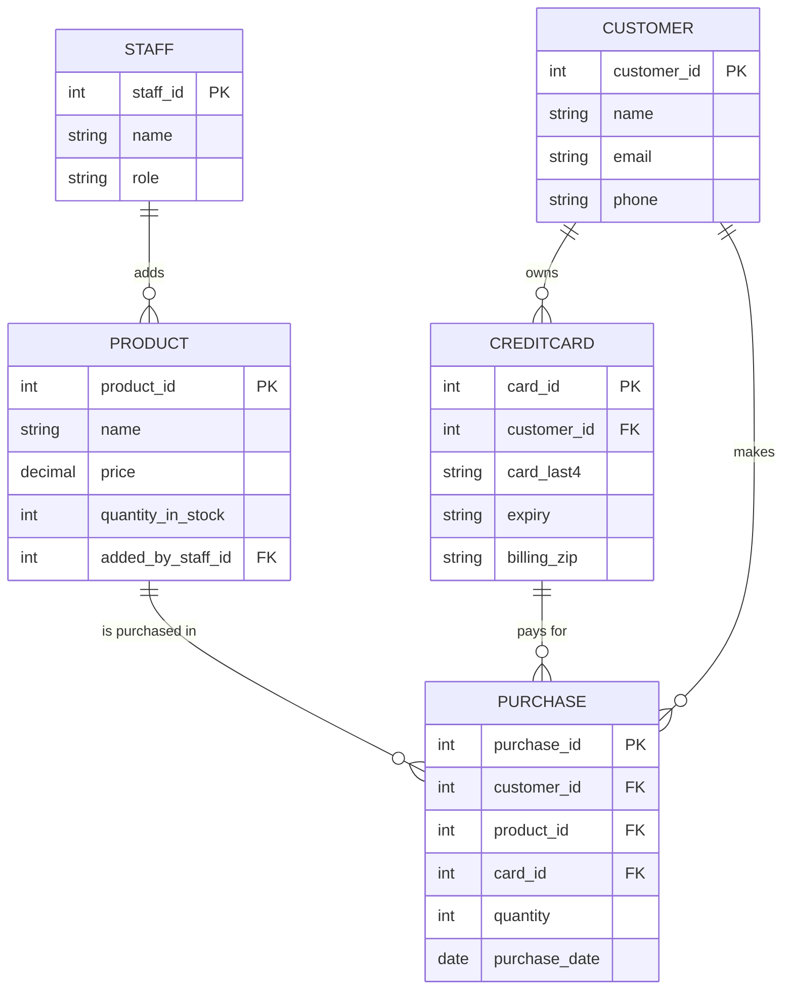

# ER Diagram — E-Commerce Backend

## Entities, Relationships, and Cardinalities

| Relationship | Cardinality | Notes |
|---|---|---|
| Staff → Product | 1-to-many | A staff member can add many products; each product is added by exactly one staff member. |
| Customer → CreditCard | 1-to-many | A customer can register multiple cards; each card belongs to exactly one customer. |
| Customer → Purchase | 1-to-many | A customer can make many purchases; each purchase belongs to exactly one customer. |
| Product → Purchase | 1-to-many | A product can appear in many purchases; each purchase line references exactly one product. |
| CreditCard → Purchase | 1-to-many | A card can be used for many purchases; each purchase uses exactly one card. |

Purchase is the resolving entity for the many-to-many relationship between Customer and
Product (a customer can buy many products, a product can be bought by many customers),
and also ties in which card was used to pay.
